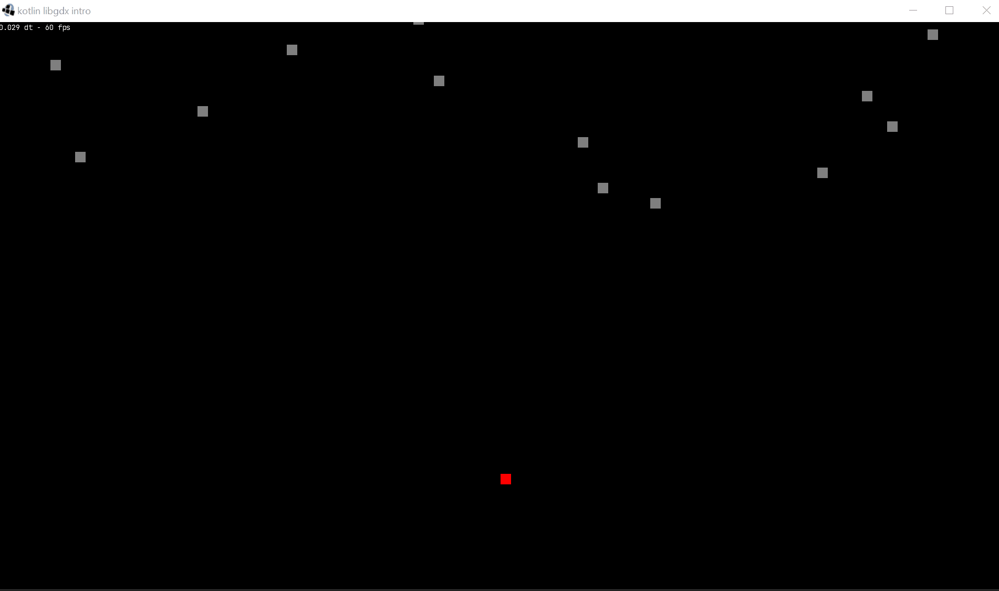

# Lage ditt første spill med LibGDX og kotlin

Vi vil starte med å lage et lite spill hvor du skal styre en firkant på skjermen som skal
unngå andre firkanter som faller ned fra toppen av skjermen. Målet med oppgaven er å gjøre
deg litt kjent med et par viktige konsepter som du kan ta med deg inn i de litt mer kreative
oppgavene.

Skjelettet av koden er allerede skrevet - og består i hovedsak av tomme metoder som
det er opp til deg å implementere i denne delen av workshopen. Vi tar det stegvis, og når
alle metodene er implementert ender man opp med et ferdig spill.

## 1. Tegne en figur (spilleren) på skjermen.

Det første vi skal gjøre er å tegne noe på skjermen, og vi starter med selve spilleren
Start med å implementere metoden `drawPlayer` slik at den tegner spillere som en firkant
på skjermen. Du kan fritt velge farge du ønsker å bruke.

Spilleren er definert som et `Rectangle` som ligger i variabelen `this.player`. Du kan
endre start posisjon og størrelse på spilleren ved å endre verdiene denne variabelen
initialiseres med.

Du kan bruke hjelpemetoden `drawRectangle` for å tegne et rektangel på skjermen.

## 2. Styre spilleren med tastaturet

Det neste vi skal gjøre er å sørge for at man kan styre spilleren med tastaturet.
Posisjonen til spilleren er definert som en `Vector2` på `player` variabelen.
Du kan velge å enten endre manipulere X og Y verdiene på denne direkte eller å bruke
hjelpemetoden `Rectangle.move` for å flytte spilleren. Veriabelen `delta` som man får
inn som argument er tiden siden forrige update, og kan brukes for å sørge for at man
får gjevn bevegelse uavhengig av update-rate. Dette kan man gjøre via å bruke den som
en faktor: `val moveDistance = movementSpeed * delta`.

For å sjekke tastatur-input kan man bruke funksjonen `Gdx.input.isKeyPressed`. F.eks.
kan man se om man holder nede `PIL OPP` med `Gdx.input.isKeyPressed(Input.Keys.UP)`.

Når man har fått spilleren til å bevege seg rundt på skjermen kan man legge til at
spilleren ikke skal få lov til å bevege seg utenfor skjermen. Bredde og høyde på skjermen
han man hente fra `EngineConfig.height` og `EngineConfig.width`.

Posisjonen til spilleren  er posisjonen til nedre venstre hjørne av rektangelet, og
det kan være fint å ta høyde for størrelsen på rektangelet når man skal holde spilleren
innenfor skjermen.

## 3. Lage bokser som spilleren må unngå

For at det skal bli et spill må det noe mer gameplay på plass. Så her er tanken at vi
skal ha noen bokser på starter på toppen av skjermen og "faller" nedover, og så er målet
å unngå å bli truffet av disse. For å få dette på plass må følgende ting implementeres:

 * `shouldSpawnNewBlocks`: Denne metoden skal returnere true om det skal lages flere blokker
    for spilleren å unngå.
 * `spawnNewBlock` Her skal den lage ny blokk(er). De nye blokkene skal ha en posisjon på
    toppen av skjermen, og et tilfeldig X-koordinat. Den nye blokken skal legges i listen
   `blocksToDodge`.
 * `drawAllBlocksToDodge`: Denne skal tegne alle blokkene som ligger i `this.blocksToDodge`.
    Dette kan gjøres ganske likt som tegning av spilleren. Men bruk gjerne en annen farge.
 * `handleMoveBlocks`: Her flytter man blokkene nedover på skjermen. I starten er det greit
    å bare flytte de med en konstant fart.

## 4. Kollisjonstesting

Om du starter main-metoden skal man når ting er implementert korrekt se at det faller ned noen
blokker fra toppen av skjermen. Men om styrer figuren din inn i en av de vil du se at det ikke
skjer noen ting. Det er som og blokkene ikke er der. Så det neste vi må få på plass er en
enkel kollisjonstest.

Om man ser ser i `update` metoden har den en sjekk på `playerIsColliding`. Hvis denne returnerer
true så kaller den `onGameLost()` som resetter spillet. Så målet nå er å implementere en sjekk i
`playerIsColliding` som sjekker om spilleren har kollidert med en av blokkene. `Rectangle.isCollidingWith`
kan brukes for å sjekke om 2 rektangler overlapper.

## 5. Ytelsesforbedring

Slik spillet er implementert nå vil det gjevnlig legges til nye blokker i listen `blocksToDodge`,
men de fjernes aldri. Over tid vil dette påvirke ytelsen både i form av at den bruker mer og mer minne
men også at den må gjøre operasjoner på fler og fler elementer som ikke lenger er relevante. Vi trenger
derfor en måte å rydde opp. 

I `update`-metoden så kaller vi `removeBlocksOutOfBounds()`. Tanken er at denne skal fjerne alle blokker
som er utenfor skjermen, og derfor ikke lenger er relevante for spillet.

## 6. Ekstra features?

Legg gjerne til litt ekstra features som du tenker kan være kult.

 * Vise hvor lenge man overlevde på en "score screen" når man taper?
 * Øke vanskelighetsgraden over tid (øke tempoet på brikkene som faller, spawne flere)
 * Blokker av ulike størrelser og med ulik fart?

Legg gjerne på kule ting du kommer på, eller gå videre til neste oppgave som er litt åpen.